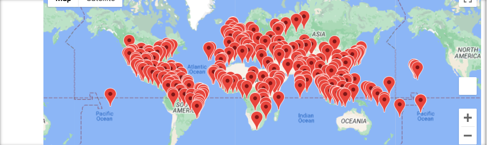
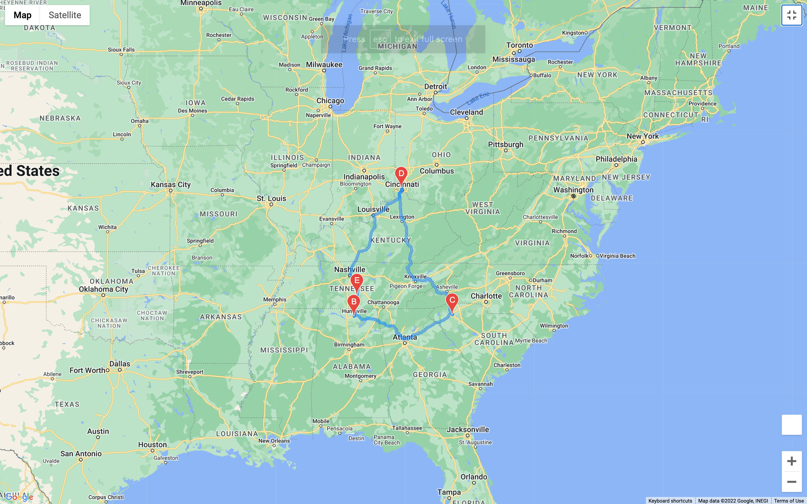

# World_Weather_Analysis - PlanMyTrip 

## Overview of Analysis

The purpose of this endeavor was to develop an updated PlanMyTrip application (app) in response to feedback from initial Beta testers that are expected to take the app to the next level. 

Recommendations were as follows: 

	1. Adding the weather description to the weather data previously extraxted 

	2. Test the app using input statements to filter the data for their weather preferences

	3. Based on user preferences, identify potential travel destinations and nearby hotels. 

	4. From the list of potential travel destinations, allow app user to choose four cities to create a travel itinerary. 

	5. Using the Google Maps Directions API, present travel route between the four cities selected with markers. 

## Results

While the API selected over 2000 records from a range up to 10,000, after the exclusion of missing hotels, the count was reduced significantly to approximately 300 options. This occurred similarly for multiple runs of code. 

We were able to produce the outputs suggested by the Beta testers and establish a four-city road trip itinerary. Please see below. 

### Map of Vacation Options

### Map of Four City Road Trip

### Markers for Lodging during Four City Road Trip

